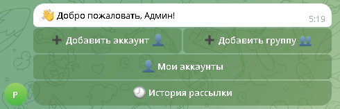
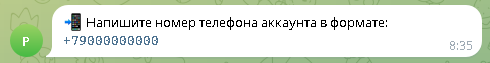
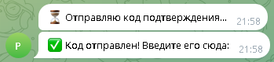
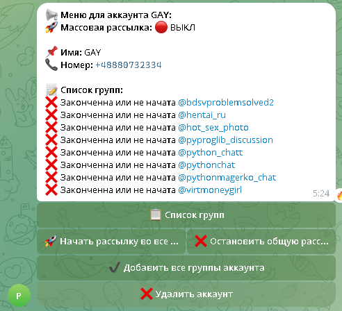
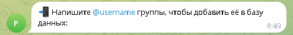
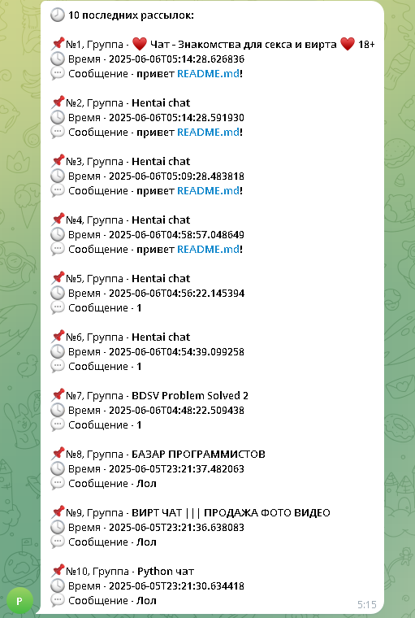

📌 Бот для рассылки сообщений
---

## Это бот для рассылки массовых сообщений в телеграмме

---
## 🚀 Возможности

- Добавление аккаунтов
- Добавление групп
- Массовая рассылка с одинаковым интервалом
- Массовая рассылка с промежуточным интервалом
- Одиночная рассылка
- История рассылок
- Отправка сообщений в приватные группы
---
## Стек

- **Python** 3.10+
- **Telethon**
- python-decouple
- SQLite3

---
## 📦 Установка и Запуск
1. Установите зависимости через консоль:
   ```bash
   pip install -r requirements.txt
   ```
2. Получите API_ID и API_HASH на сайте телеграмма
3. Получите токен бота у @BotFather 
4. Получите id вашего(-их) аккаунтов в телеграмм
5. Настройте конфиг:
   Заполните `.env`:
   ```dotenv
    API_ID='Ваш API_ID'
    API_HASH='Ваш API_HASH'
    BOT_TOKEN='Ваш токен бота'
    ADMIN_ID_LIST= # <-- Вставить ID разрешенных телеграмм аккаунтов через запятую
    # Остальные параметры...
   ```
6. Получите id вашего(-их) аккаунтов в телеграмм
7. 🖥 Запустите файл main.py через интерфейс **IDE** или через консоль:
   ```bash
   python main.py
   ```
---
# Действия в боте

## Аккаунт

### Добавление Аккаунта
1. Откройте бота и нажмите ```/start``` :


2. Выберете пункт **Добавить аккаунт** и введите ваш номер телефона


3. Введите код подтверждения отправленный в телеграмм


4. Введите пароль от аккаунта если у вас он установлен

---

### Просмотр Аккаунта
1. Откройте бота и нажмите ```/start``` :


2. Выберете пункт **Мои аккаунты**
3. Вам Отобразятся список ваших аккаунтов:


4. Выберете аккаунт который вы хотите просмотреть и нажмите на пункт в списке
5. Вам отобразится информация об аккаунте


6. Вам будет показана информация об аккаунте и групп

---

### Удаление аккаунта
1. Откройте бота и нажмите ```/start``` :


2. Выберете пункт **Мои аккаунты**
3. Вам Отобразятся список ваших аккаунтов:


4. Выберете аккаунт который вы хотите удалить и нажмите на пункт в списке
5. Выберете пункт **Удалить аккаунт**


6. Введите номер телефона аккаунта который хотите удалить

---

## Группы

### Добавления группы
1. Откройте бота и нажмите ```/start``` :


2. Выберете пункт **Добавить группу**
3. Введите ***username*** группы:



---

### Добавления всех групп аккаунта
1. Откройте бота и нажмите ```/start``` :


2. Выберете пункт **Мои аккаунты**
3. Вам Отобразятся список ваших аккаунтов:


4. Выберете аккаунт группы которого вы хотите добавить
5. Выберете пункт **Добавить все группы аккаунта**


---

### Просмотр групп
1. Откройте бота и нажмите ```/start``` :


2. Выберете пункт **Мои аккаунты**
3. Вам Отобразятся список ваших аккаунтов:


4. Выберете аккаунт группы которого вы хотите просмотреть и нажмите на пункт в списке


5. Вам отобразится список групп с указанием идет ли массовая рассылка

---

### Просмотр одной группы
1. Откройте бота и нажмите ```/start``` :


2. Выберете пункт **Мои аккаунты**
3. Вам Отобразятся список ваших аккаунтов:


4. Выберете аккаунт группу которого вы хотите просмотреть и нажмите на пункт в списке


5. Выберете пункт **Список групп**


6. Выберете группу информацию о которой вы хотите узнать


7. Вам будет отраженно информация о группе, о тексте рассылке, интервале рассылке и статусе рассылки этой группы

---

## Массовая Рассылка

### Запуск массовой рассылки
1. Откройте бота и нажмите ```/start``` :


2. Выберете пункт **Мои аккаунты**
3. Вам Отобразятся список ваших аккаунтов:


4. Выберете аккаунт из которого вы хотите начать рассылку


5. Выберете пункт **Начать рассылку во все группы**
6. Выберете режим отправки


7. Отправте текст массовой рассылки


8. Если вы выбрали Одинаковый интервал введите одно число. Интервал рассылки между группами


9. Если вы выбрали разный интервал то введите минимальную границу


10. Далее введите максимальный интервал рассылки


11. Массовая рассылка запустится


---
### Остановка массовой рассылки
1. Откройте бота и нажмите ```/start``` :


2. Выберете пункт **Мои аккаунты**
3. Вам Отобразятся список ваших аккаунтов:


4. Выберете аккаунт группу которого вы хотите просмотреть и нажмите на пункт в списке


5. Вам отобразятся параметры рассылки, и активность рассылок. 
6. Выберете пункт **Остановить общую рассылку**
7. Все рассылки прекратятся


---
### Статус групп рассылки
1. Откройте бота и нажмите ```/start``` :


2. Выберете пункт **Мои аккаунты**
3. Вам Отобразятся список ваших аккаунтов:


4. Выберете аккаунт группу которого вы хотите просмотреть и нажмите на пункт в списке


5. Вам отобразятся параметры рассылки, и активность рассылок. 
6. Также вы можете посмотреть параметры рассылок и активность в списке групп и в информации о каждой группе отдельно


---

## Одиночная Рассылка

### Запуск массовой рассылки
1. Откройте бота и нажмите ```/start``` :


2. Выберете пункт **Мои аккаунты**
3. Вам Отобразятся список ваших аккаунтов:


4. Выберете аккаунт в которой вы хотите запустить одиночную рассылку


5. Выберете пункт **Список групп**


6. Выберете группу которую вы хотите запустить рассылку


7. Настройте текст рассылки и интервал выбрав пункт **Текст и Интервал рассылки**
8. Введите текст рассылки 


9. Введите интервал рассылки 


10. После настройки параметров вернитесь в меню информации о группе и выбирете пункт **Начать/возобновить рассылку**
11. Рассылка запущенна


---
### Остановка массовой рассылки
1. Откройте бота и нажмите ```/start``` :


2. Выберете пункт **Мои аккаунты**
3. Вам Отобразятся список ваших аккаунтов:


4. Выберете аккаунт в которой вы хотите запустить одиночную рассылку


5. Выберете пункт **Список групп**


6. Выберете группу которую вы хотите остановить рассылку


7. Выберете пункт **Остановить рассылку**
8. Рассылка для этой группы буедт остановленна


---
### Изменение параметров одиночной рассылки
1. Откройте бота и нажмите ```/start``` :


2. Выберете пункт **Мои аккаунты**
3. Вам Отобразятся список ваших аккаунтов:


4. Выберете аккаунт в которой вы хотите запустить одиночную рассылку


5. Выберете пункт **Список групп**


6. Выберете группу которую вы хотите изменить параметры рассылки


7. Настройте текст рассылки и интервал выбрав пункт **Текст и Интервал рассылки**
8. Введите текст рассылки 


9. Введите интервал рассылки 


10. Параметры рассылки успешно настроенны


---
## История рассылок

1. Откройте бота и нажмите ```/start``` :


2. Выберете пункт **История рассылки**
3. Вам отобразятся 10 последних рассылок с указанием группы рассылки, Времени рассылки и сообщением рассылки



---

# Структура проекта
```
. Bot
├── func/ # Дополнительные функции
│   ├── __init__.py # Точка входа модуля
│   ├── db_func.py # Функции базы данных
│   └── func.py # Общие функции
├── handlers/ # Хандлеры бота 
│   ├── __init__.py # Точка входа модуля ханделеров
│   ├── add_account_handlers.py # Хандлеры для добавления аккаунта в базу данных
│   ├── add_groups_handlers.py # Хандлеры для добавления группы в базу данных
│   ├── broadcast_all_start_handlers.py # Хандлеры для массовой рассылки
│   ├── broadcasts_start_handlers.py # Хандлеры для одиночной рассылки
│   ├── delete_account_handlers.py # Хандлеры для удаление аккаунта
│   ├── delete_group_handlers.py # Хандлеры для удаления группы
│   ├── group_info_handlers.py # Хандлеры для отображения информации о группах
│   ├── history_handlers.py # Хандлеры для истории рассылок
│   ├── my_account_handlers.py # Хандлеры для отображения информации об аккаунте
│   ├── my_groups_handlers.py # Хандлеры для отображения информации об группах
│   └── start_handlers.py # Хандлер команды /start
├── img / # Изображения для README
├── .env # Конфигурационные файлы
├── config.py # Конфиг файл
├── .gitignore # Файл для игнорирования ненужных файлов
├── main.py # Точка входа
├── README.md # Этот файл
├── sessiobs.db # База данных
└── requirements.txt # Зависимости проекта
```
